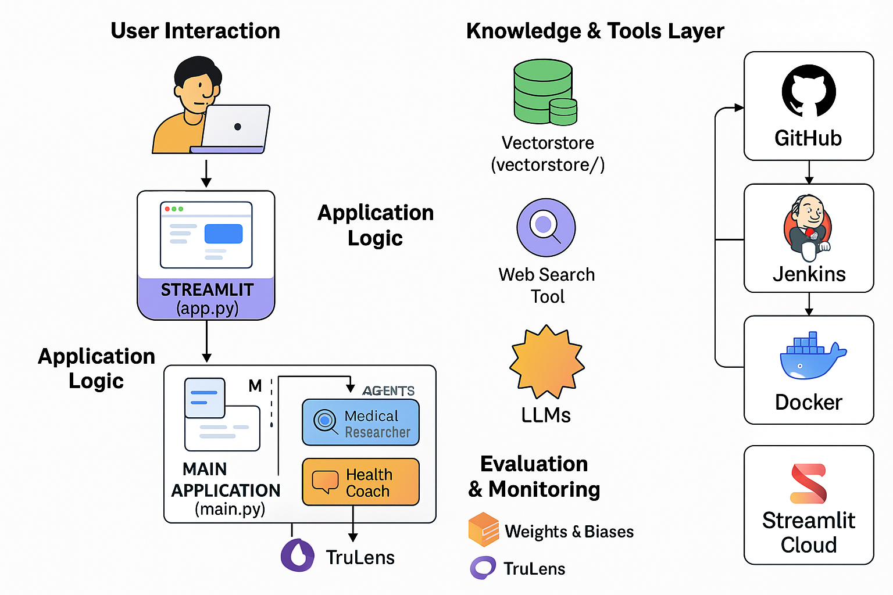

# 🩺 Diabetes FAQ Chatbot 🧠 (CrewAI + Mistral + RAG)

A multi-agent Agentic RAG AI system that answers diabetes-related questions using trusted medical sources (like ADA, CDC, NIDDK) and web search. Built with CrewAI, LangChain, Pinecone, and Mistral.

> 🎯 Designed to showcase advanced agent architectures, custom tools, vector-based retrieval, and LLM-based evaluation — suitable for production use or as a portfolio demo.

<br>
<!-- Click below link to view demo -->

---

## 🚀 Features

✅ Vector DB from authoritative health sites (ADA, CDC, etc.)  
✅ Multi-agent architecture using [CrewAI](https://github.com/crewAIInc/crewAI)  
✅ Two specialized agents:  
  🔬 **Medical Researcher** → Pulls factual data from docs  
  🏋️ **Health Coach** → Uses web search for practical advice  
✅ RAG tool + real-time web search tool  
✅ Mistral-powered answers via [mistralai](https://docs.mistral.ai)  
✅ Logging and answer export (per-agent `.txt`)  
✅ LLM-based answer evaluation for truthfulness, hallucination (context relevance, groundedness and answer relevance), and clarity.
✅ Guardrails for threshold check.

---

## 🏗️ Architecture Overview


---
## 📁 Project Structure

```
diabetes_expert_system/
├── Jenkinsfile                       # ✅ Jenkins pipeline script
├── requirements.txt                  # ✅ All dependencies
├── evaluation.py                     # ✅ TruLens-based eval logic
├── wnb_eval.py                       # ✅ Weights & Biases based monitoring
├── main.py                           # 🧠 Runs the CrewAI agents
├── app.py                            # ✅ Stremlit app
├── agents/                           # 👥 Crew AI Agents
│   ├── medical_researcher.py
│   └── health_coach.py
├── tools/                            # 🛠 Custom Tools using BaseTool subclasses
│   ├── retrieve_information.py
│   └── web_search_tool.py
├── utils/
│   └── logger.py                     # 🪵 Logging setup
├── tasks.py                          # 📋 Crew tasks
├── logs/                             # 🧾 Output + evaluation results
│   ├── medical_research.txt
│   ├── lifestyle_advice.txt
│   └── eval_results.json
├── vectorstore/                      # 💾 FAISS vector DB (Depreciated, using Pinecone)
└── .env                              # 🔐 API keys (optional)
```


---

## 🔧 Setup Instructions

```bash
# 1. Clone and setup
git clone https://github.com/MOAZ47/Diabetes-FAQ-Chatbot
cd diabetes-expert-system

# 2. Install dependencies
pip install -r requirements.txt

# 3. Setup environment variables (.env)
MISTRAL_API_KEY=your_mistral_api_key
TAVILY_API_KEY=your_tavily_api_key
HF_TOKEN=your_huggingface_token
PINECONE_API_KEY=your_pinecone_api_key

# 4. Run
python main.py
```

---

## 📊 Evaluation (LLM-as-a-Judge)

Run answer quality evaluation with:

```bash
# 1. Trulens based evaluation
python evaluation.py

# 2. Weights & Biases monitoring
python evaluation_wnb.py
```

Output saved to:

```bash
logs/trulens_eval_results.json
```

Metrics include:

<ul>
   <li>✅ Coherence</li>
   <li>🧠 Grounding</li>
   <li>🚫 Context Relevance</li>
   <li>✍️ Answer Relevance</li>
</ul>


--- 
## 👨‍💻 Author
Moaz Mohammed Husain
🛠 AI/ML Engineer | 🧱 Building Intelligent Agents
(📫 LinkedIn)[https://www.linkedin.com/in/moaz-mohammed-husain/] 
